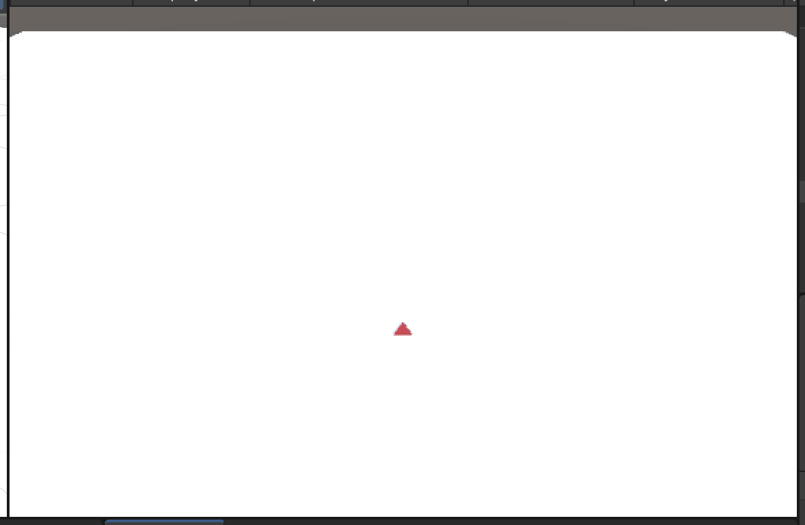

# How to Use

## (Dev Scene) Camera

Camera Controller attatched to the Main Camera GameObject supports Camera Control.  

* Mouse: Rotating camera.
* `W` `S` Key: Move forward/backward.
* `A` `D` Key: Move left/right.
* `Q` `E` Key: Move up/down.
